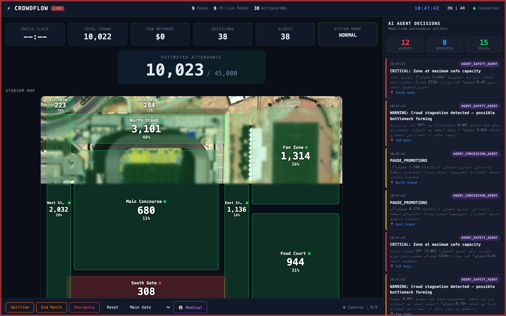

# CrowdFlow

Real-time AI crowd management and stadium optimization system. Built for the Sports Innovation Hackathon — Riyadh 2026.

CrowdFlow uses computer vision to monitor live camera feeds across stadium zones, estimates crowd density in real time, and deploys autonomous AI agents that make safety, crowd flow, and revenue decisions — all surfaced through a live operations dashboard and a bilingual fan-facing web app.



## Architecture

```
Camera Feeds ──► VisionPipeline ──► Redis Pub/Sub ──► AI Agents ──► Dashboard
                  (YOLOv8 +                           │               │
                   Dense Est. +                        ▼               ▼
                   Gate Counters)                  Agent Actions   Fan Web App
```

**Vision Pipeline** — Dual-mode detection per zone:
- **YOLO mode** (`cv_yolo`): YOLOv8n object detection for low-to-moderate density
- **Dense mode** (`cv_dense`): MOG2 background subtraction + contour analysis for high-density crowds
- **Gate counters**: ByteTrack tripwire-based IN/OUT counting at entry/exit zones
- **Optical flow**: Farneback flow analysis for crowd direction and speed
- **Cross-calibration**: Automatic factor alignment between YOLO and dense estimators

**AI Agents** — Three autonomous agents with priority hierarchy:
1. **Safety Agent** (highest priority) — Monitors density thresholds across three escalation tiers (warning → standstill → crush risk), triggers emergency alerts and evacuation protocols
2. **Crowd Flow Agent** — Manages traffic redistribution, gate balancing, and rerouting when zones become congested
3. **Concession Agent** — Dynamic pricing, flash deals, and targeted promotions based on zone occupancy and match events

**Backend** — FastAPI server with WebSocket streaming and REST API for zone data, fan Q&A (Arabic/English), and demo scenario triggers.

## Tech Stack

| Layer | Technology |
|-------|-----------|
| Vision | YOLOv8, OpenCV, ByteTrack, Farneback Optical Flow |
| Backend | FastAPI, Uvicorn, WebSockets |
| Messaging | Redis Pub/Sub |
| Data | Pydantic schemas, EMA smoothing, staleness monitoring |
| Frontend | Vanilla HTML/JS, WebSocket clients |
| Language | Python 3.9+ |

## Quick Start

### Prerequisites

- Python 3.9+
- Redis server
- Video files placed in `data/videos/` (see `config/zones.json` for expected filenames)
- YOLOv8n weights (`yolov8n.pt` in project root — downloaded automatically by `ultralytics` on first run)

### Setup

```bash
# Clone the repo
git clone https://github.com/AliAA1444/CrowdFlow-Hackathon.git
cd CrowdFlow-Hackathon

# Create virtual environment
python3 -m venv .venv
source .venv/bin/activate

# Install dependencies
pip install -r requirements.txt

# Start Redis
docker compose up -d
# or: redis-server --daemonize yes

# Run the demo
python run_demo.py
```

### Demo Options

```bash
python run_demo.py                    # Standard run
python run_demo.py --loop             # Loop videos 5x via ffmpeg for extended demos
python run_demo.py --no-calibration   # Freeze cross-calibration at manual baselines
```

### Endpoints

| URL | Description |
|-----|-------------|
| `http://localhost:8000/dashboard` | Operations dashboard |
| `http://localhost:8000/fan` | Fan web app (AR/EN) |
| `http://localhost:8000/docs` | API documentation |
| `http://localhost:8000/api/zones` | Zone data (JSON) |
| `http://localhost:8000/api/health` | Health check |

### Demo Scenarios

Trigger scenarios via the dashboard or API:

```bash
# Halftime rush simulation
curl -X POST http://localhost:8000/api/demo/trigger-halftime

# Emergency density spike
curl -X POST "http://localhost:8000/api/demo/trigger-emergency?zone_id=zone_north_gate&density=6.2"

# End-of-match exit surge
curl -X POST http://localhost:8000/api/demo/trigger-endmatch

# Medical emergency override
curl -X POST http://localhost:8000/api/demo/trigger-medical \
  -H "Content-Type: application/json" \
  -d '{"zone_id": "zone_north_concourse", "reason": "Fan collapse near Section 12"}'

# Reset all scenarios
curl -X POST http://localhost:8000/api/demo/reset
```

## Project Structure

```
├── agents/                 # Autonomous AI agents
│   ├── base_agent.py       # Abstract base with Redis pub/sub lifecycle
│   ├── safety_agent.py     # Density monitoring and emergency escalation
│   ├── crowd_flow_agent.py # Traffic redistribution and gate balancing
│   ├── concession_agent.py # Dynamic pricing and fan promotions
│   ├── agent_runner.py     # Centralized agent evaluation loop
│   └── cooldown_manager.py # Per-zone action cooldown tracking
├── vision/                 # Computer vision pipeline
│   ├── pipeline.py         # Dual-mode YOLO/dense orchestrator
│   ├── density_estimator.py# MOG2 background subtraction estimator
│   ├── gate_counter.py     # ByteTrack tripwire IN/OUT counter
│   ├── flow_analyzer.py    # Farneback optical flow analysis
│   └── cross_calibrator.py # YOLO ↔ dense count calibration
├── core/                   # Shared infrastructure
│   ├── schemas.py          # Pydantic ZoneUpdate model
│   ├── smoothing.py        # EMA smoothing engine
│   ├── redis_publisher.py  # Zone data publisher
│   ├── staleness.py        # Feed watchdog monitor
│   └── zone_state_cache.py # In-memory zone state cache
├── backend/                # FastAPI server
│   └── main.py             # WebSocket + REST endpoints
├── dashboard/              # Operations dashboard (HTML/JS)
│   └── index.html
├── fan-webapp/             # Fan-facing app (Arabic/English)
│   └── index.html
├── config/                 # Zone and camera configuration
│   └── zones.json
├── config.py               # Centralized settings and thresholds
├── run_demo.py             # Single-command demo launcher
├── docker-compose.yml      # Redis service
└── requirements.txt
```

## License

Copyright (c) 2026 Ali Alkhamees. All Rights Reserved.
